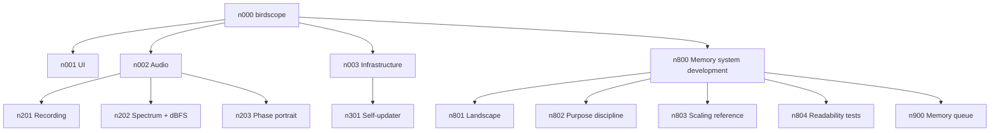

# Memory overview

> **Audience: human operators.** If you are an LLM opening this project,
> do **not** use this file as your map. Open `root.json` and descend by
> `purpose` fields on each link. The leaves contain real detail; this file
> is a hand-maintained snapshot that drifts and is shallower on purpose.

Visual + tabular view of the memory tree for at-a-glance reading.
Source of truth: the JSON branches and markdown leaves themselves.
When this file disagrees with them, trust them and update this file.

## Tree

## Nodes

### Product branches

| ID   | Name              | Kind   | Status   | Code ref | Purpose |
|------|-------------------|--------|----------|----------|---------|
| n000 | birdscope         | branch | -        | -        | root node; entry point for any LLM opening this project |
| n001 | UI                | branch | -        | -        | user-facing surface: windows, controls, menus, overlays |
| n002 | Audio             | branch | -        | -        | audio subsystem: capture, analysis, visualization |
| n003 | Infrastructure    | branch | -        | -        | non-feature plumbing: build pipeline, signing, self-updater |
| n201 | Recording         | leaf   | done     | (commit) | WAV capture + mic name display; first feature beyond updater |
| n202 | Spectrum + dBFS   | leaf   | done     | (commit) | live FFT spectrum and max/min dBFS readouts during recording |
| n203 | Phase portrait    | leaf   | done     | (commit) | delay-embedded 2D scatter visualization of the audio signal |
| n301 | Self-updater      | leaf   | done     | (commit) | in-app updater that fetches latest GitHub release and installs the APK |

### Memory system development

| ID   | Name                  | Kind | Status   | Purpose |
|------|-----------------------|------|----------|---------|
| n800 | Memory system dev     | branch | -      | meta-branch: work on the memory system itself |
| n801 | Landscape             | leaf | open     | external work moving in similar direction |
| n802 | Purpose discipline    | leaf | open     | rules for writing good `purpose` fields |
| n803 | Scaling reference     | leaf | deferred | what to do as memory grows; revisit when 30+ nodes or after 2026-08-31 |
| n804 | Readability tests     | leaf | open     | log of probes from fresh LLM sessions |
| n900 | Memory queue          | leaf | open     | deferred work on the memory system itself |

## How to update

When a node is added, removed, renamed, or changes status:
1. Update the Mermaid block above (add/remove/rename node, add/remove edge).
2. Update the corresponding row in the tables.
3. Commit alongside the change that triggered the update, or right after.

When this becomes tedious (around 30+ nodes), replace by a generator
script that reads JSON branches and leaf frontmatter — see `n803`.